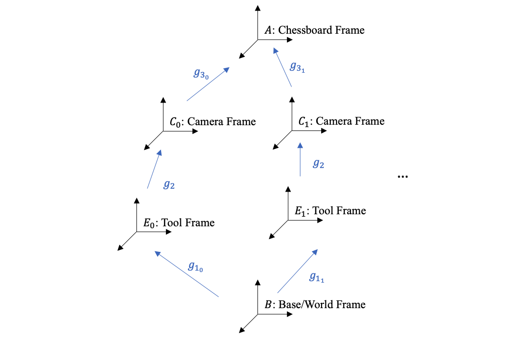

---
## VIDEO DEMO



---
## OVERVIEW

* We were required to program QKM manipulators to play Jenga automatically
* My part was doing hand-eye calibration, blob analysis, path/trajectory planning and simple UI
* The robot operates like this:
    1. Take a picture with camera and calculate target positions
    2. Do path and trajectory planning
    3. Upload planned trajectory to bot
    4. Run

---
## HAND-EYE CALIBRATION

### HEC Explained in A Nutshell

* Aims to find the transform matrix from camera frame to tool frame.
* Intrinsic params: `cv::calibrateCamera()`
* Solve for pose of the calibration board in camera frame: `cv::solvePnP()`
* Solve for end effector transformation matrix and use `cv::calibrateHandEye()` to finish the process

### Solving the AX=XB Problem

* Consider the transformation $T_{E_1 \rightarrow C_0}=g_{1_1}^{-1}g_{1_0}g_2=g_2g_{3_1}g_{3_0}^{-1}$, where $g$ stands for the configuration of a frame
* By taking N pictures, we can make use of N equations to solve $AX=XB$
* Actual solver is implemented by OpenCV: `cv::calibrateHandEye()`
* Subproblem 1: How to find $g_{3_i }$?
  * `cv::calibrateCamera()`
  * `cv::solvePnP()`
* Subproblem 2: How to find $g_{1_i }$?
  * Forward kinematics

---
## JENGA DETECTION

* Blob Analysis:
    1. RGB to HSV
    2. Get blob areas based on color filtering
    3. Apply morphology process to eliminate cracks and dots
    4. Find blob contours and corresponding `minAreaRect`

* Coordinates transformation:
    1. Pixel frame to camera frame: $q_{pixel}Z_c=KDq_{camera}$
    2. Camera frame to world frame: $q_{world}=g_1g_2q_{camera}$

* Sort targets by the distance to base in ascending order, because we need to take into consideration of the height of already built structure and make sure that the planned path does not crush it

---
## TRAJECTORY PLANNING

* Linear function with parabolic bends and via points
Apply inverse kinematics with given starting, ending and via points to find corresponding points in joint space

* Doing trajectory planning in joint space directly is much faster because of absence of calculating inverse

* To avoid collision and damage, trajectories are first visualized in MATLAB

---
## RELATED LINKS

* [Source Code](https://github.com/TANGBEN7/HLJenga)