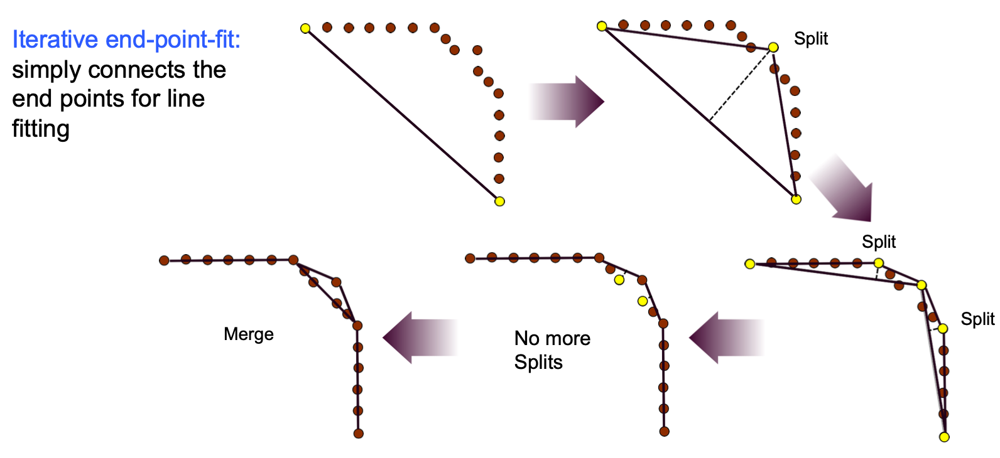

> 篇幅较长，请先浏览目录，方便导航哦～

---
## 2021年12.31考试内容
* 机器人的自由度计算
* 轮子的自由度
* sobel算子作用
* 直线检测各种算法原理
* 搜索算法哪个完备
* 概率框架下的定位模型
* 什么噪声没办法去除
* dijkstra
* markov定位图
* split merge
* 势场法导航
* 卡尔曼滤波的k矩阵
* 单轮驱动的运动模型，自由度
* odom模型和误差传播

---
## 绪论

### 按功能分类
* 移动机器人
* 操作机器人
* 移动作业机器人
* 举些例子：机械臂，月球车，心脏手术，扫地，UAV，自驾车

### 应用领域
* 工业
* 空间探测
* 军事
* 医疗手术
* 家庭

### 自动化
* 自主性(autonomy)是行为主体按自己意愿行事的动机、能力或特性
    * 自主移动机器人是一类可以根据任务需求、具有在单维或多维空间主动改变自身位姿以及空间位置能力的机器人统称
    * 自动驾驶分级：0-2级需要驾驶员实时介入，自动驾驶提供辅助速度和车道控制；3级有时会要求接管驾驶，4级开始是在特定环境下完全自主，5级是所有环境下全自主
        * 0-2：特斯拉，小鹏，未来
        * 没有一个达到了3
* 三大关键问题：在哪，去哪，怎么去
* 经典3环节
    * see (perception): sensing, info extraction (filtering, keypoint extraction and matching)
    * think (planning/understanding): localizatoon, mapping, planning
    * act (motion control): tracking, actuator driving

---
## 运动形式

### 运动相关的概念
* locomotion，运动，是一种机器人与环境的物理交互
* 稳定性考虑：接触点数目和形状（角度，摩擦），重心，环境（地形，空气），本体稳定性

### 两种地面运动形式
* 腿式运动
    * 自然界偏爱，自然界表面粗糙，环境复杂
    * 通过性强，控制困难，非连续点接触
    * 效率取决于本体质量
    * 近似滚动多边形，随着步距减小，接近圆形
* 轮式运动
    * 自然界基本没有，因为关节不能旋转
    * 在平面上运动效率高，控制简单，受环境约束大
    * 效率取决于环境质量

### 腿式机器人
* 特点（因为不同场景下优点和弱点互相转换）包括：适应地形，自主调节重心高度，运动执行器也能当成操作器，主动隔离震动，自由度高，难控制建模，对关节驱动要求高，需要配合地形感知，落地有冲击
* 稳定性
    * 动态稳定指的是执行器停止工作时机器人摔倒，反之则是静态稳定的
    * 静止时保持稳定的条件
        * 点接触腿需要三支同时着地（波士顿动力方案，快，动态稳定，能耗低）
        * 面接触腿只需要一支（比如日本方案的双足，静态稳定，慢，能耗高）
    * 运动时保持稳定的条件
        * 静态步态行走需要4-6条腿
* 关节数和自由度：每个腿至少需要两个自由度，增加自由度可以提高机动性、步态稳定性，同时增加设计难度
* 可能事件总数Gait/步态：一个行进周期内腿式机器人每条腿抬起和落地可能性的组合$=(2k-1)\!$注意与腿状态数区分 $=2^k$

### 轮式机器人
* 特点：人造结构的高效性（滚动摩擦，重心不会起伏变化），结构简单，成本低，控制简单，系统复杂度低，运行速度高
* 稳定性：至少有三个车轮同时接触地面才能保证静态稳定性（重心落在接触点的三角形内部），3个轮子以上需要悬挂系统使所有轮子保持与地面接触
* 轮子类型
    * 标准轮，DOF=2
    * 脚轮，DOF=3，调向时会对机器人底盘施加一个扭矩，偏心距d:触地点到垂直旋转轴的距离
    * 瑞典轮（十字连续切换90/麦克纳姆45），DOF=3，无法单独使用，至少需三个或以上共同使用，对地面冲击大，噪音大，易破坏地面，运行震动大，对机器人本体机构冲击大
    * 球轮，DOF=3，无约束:具有很高的灵活性，成本高:制造和维护成本均很高，积灰、磨损
* 全向驱动经典布局：等边三角形，瑞典轮，转向标准轮，4麦克纳姆

---
## 轮式机器人运动学

### 非完整约束
* 大部分轮式机器人形态均含有非完整约束，即无法从位置空间找到一一对应的关系，和历史状态有关
* 需要扩展到速度空间 (车轮间相对位置增量的差别)考虑微分运动学

### 坐标系描述
* 惯性参考坐标系 $\xi_I$ ：机器人作业目标及控制指令，传感器感知测量的环境信息
* 机器人参考坐标系 $\xi_R$ ：机器人控制器的误差输入以及控制指令
* config矩阵可以是 $3 \times 3$ ：因为只有两个维度
* $\bold{\dot{\xi_I}=R(\theta)\dot{\xi_R}}$ ，两个坐标系下的速度之间关系为旋转矩阵

### (前向)运动学模型
* 指建立惯性系下参考点速度和执行器速度之间的关系
* 中间桥梁为机器人系下参考点速度
* 构建方法
    * 作用法：从轮运动参数（转速，半径，轮距），进行速度的合成与分解（同时考虑约束作用），得到参考点在机体坐标系下的速度，然后通过旋转矩阵转为世界坐标系
    * 约束法：把每个轮子的约束方程写出来（轮运动参数与机体坐标下速度的关系），合并成一个式子并转换为世界坐标速度
* 标准轮约束
    * 主动固定标准轮：$v_{\parallel}=r \dot{\phi}$ 以及 $v_{\perp}=0$ ；将 $v_{\parallel}$ 和 $v_{\perp}$ 用机体坐标系下的速度表示出来
    * 主动转向标准轮：滚动约束，可控制角度来改变运动： $v_{\parallel}=r \dot{\phi}$
    * 随动固定标准轮：无侧滑约束（滑动约束）： $v_{\perp}=0$
    * 随动转向标准轮：自由
* 脚轮约束
    * 作为主动轮：滚动约束，可控制角度来改变运动
    * 作为从动轮：自由
* 球轮约束
    * 主动：与主动转向标准轮一致
    * 从动：自由
* 瑞典轮约束
    * 主动：驱动速度 $\dot{\phi} r$ 往转子上投影作为最终这个执行器产生的速度，没有无侧滑约束
        * 记 $\gamma$ 为滚子轴与轮平面的夹角，则滚动约束为 $\dot{\phi} r \cos(\gamma)=v_{\parallel}$ ，这里 $v_{\parallel}$ 指的是机体坐标系下速度滚子轴方向的投影
    * 从动：自由
* 零运动直线：几何上经过轮子的轴心并垂直于轮平面的线，当受无侧滑约束时，轮子在该直线上不能存在运动
    * 脚轮、瑞典轮：不存在无侧滑约束，不存在零运动直线
* 轮式移动机器人运动学建模仅考虑平面运动，因此其对应的输出状态为三维向量，因此，最多有三个独立约束
* 动力学建模在运动变化较为快速、动态响应比较明显的情况下适用，比如无人机上

### 自由度
* 自由度是机动性的度量
* 总自由度=移动mobility自由度+操纵steerability自由度：$\delta_{M}=\delta_{m}+\delta_{s}$
    * $\delta_{M}=3$：瞬心可在平面的任意点，可在工作空间中跟踪任何路径
    * $\delta_{M}=2$：瞬心被限制在某条直线上
* 移动自由度（可移动度）$\delta_{m}$
    * $\delta_{m}=$ 工作空间维度 $-$ 独立约束数目 $=$ 状态向量的维度 $-$ 滑动约束中的独立约束个数
    * 考虑 $\bold{AR\dot{\xi_I}} = [\bold{B,0}]^T$ 这样动力学模型的基本形式，与 $\bold{0}$ 对应的 $\bold{A}$ 的部分子矩阵零空间维度 $=$ 列数 $-$ 秩 $=\delta_{m}$
    * $\delta_{m}=0$ 时无法在平面中运动， $\delta_{m}=1$ 时只能沿着圆弧/直线行走（移动性退化）， $\delta_{m}=2$ 时可原地（线速度和角速度解耦）， $\delta_{m}=3$ 时全向
        * 二轮差速小车：通过改变轮转速可同时控制角速度和线速度， $\delta_{m}=2$
        * 自行车：改变主动轮转速只能改变线速度，角速度要通过另一个轮子的方向， $\delta_{m}=1$
* 操纵自由度（可操纵度） $\delta_{s}$
    * 等于独立的能够转向的舵机的个数，范围是 $[0,2]$
    * 考虑 $\bold{A}$ 矩阵中滑动约束部分，挑出其中转向轮的子矩阵，求秩，则等于 $\delta_{s}$
* 机器人的完整性判据：可移动度等于工作空间维度
    * 对于地面移动机器人，工作空间维度是3

---
## 二轮差速机器人的控制

> 只考虑运动学控制，仅分析二轮差速小车

### 术语和零碎知识点
* 定点(镇定)控制Regulation Control：以指定姿态到达指定工作位置
* 路径跟踪控制Path Tracking Control：跟随给定路线
* 轨迹跟踪控制Trajectory Tracking Control：跟随给定的轨迹
* 对于非完整约束机器人而言，不存在静态反馈控制律，使得机器人达到目标位姿
* 移动机器人反馈控制器设计一般步骤
    1. 根据作业需求定义系统开环误差信号
    2. 误差信号描述变换:惯性参考坐标系、机器人参考坐标系
    3. 基于机器人模型，构建闭环系统误差模型
    4. 控制器设计
    5. 稳定性分析
    6. 仿真实验
    7. 实际实验
* 自治系统(Autonomous system)：控制量只依赖状态不依赖时间
* 微分平坦(differentially flat)系统：控制量可以用状态量及其导数来表示
* 非完整约束系统总是欠驱动系统
* 可控：能通过施加控制使系统到达状态空间中的任意一个状态，是模型本身的性质，与控制量无关
* 系统存在光滑的反馈控制的必要条件，Brockett定理

### 定点控制

* 记号和问题描述
    * $q=[x,y,\theta]^T$ 为世界坐标系下的状态
    * $q_r=[x_r,y_r,\theta_r]^T$ 为世界坐标系下参考状态
    * $\tilde{q}=[\tilde{x},\tilde{y},\tilde{\theta}]^T=q-q_r$ 为开环误差
    * $e=\bold{R(\theta)^T} \tilde{q}$ 为机体坐标系下误差信号
    * 误差的动态模型是 $\dot{e}$ 使用“左导右不导……”可展开，矩阵求导这里是每个元素分别求导即可
    * 定点控制是找到一系列 $\bold{\dot{\xi_R}} = [v(t),\omega(t)]^T = [\dot{x}(t), \dot{y}(t), \omega(t)]^T = \bold{K}e$ 使 $e(t)=0$， 这里 $\bold{K}$ 为控制矩阵，是要设计的变量， $\bold{\dot{\xi_R}}$ 则能通过运动学模型转化为执行器需要的输出
    * 这个模型中 $\dot{y}(t)=0$ ， $\dot{x}(t)=v(t)$
* 惯性坐标系中机器人的运动学模型
    * $\bold{\dot{\xi_I}} = \bold{R(\theta)\bold{\dot{\xi_R}}}$
    * 根据此以及Brockett定理可判定对于这个模型，没有光滑的反馈控制
    * 根据Chow定理是可控的
* 非线性控制器
    * 记机体坐标系下误差信号为 $e=[e_1,e_2,e_3]^T$
    * 可令 $v(t)=-k_1 e_1$ ，单纯的比例控制
    * 可令 $\omega(t)=-k_2 e_3 + {e_2}^2\sin(t)$ ，比例控制加前馈
    * 如此带入误差的动态模型 $\dot{e}$ 可以进行稳定性分析
* 极坐标线性化
    * $\tilde{q}=[\rho, \alpha, \beta]$
    * 误差模型则是 $\dot{\tilde{q}}=\bold{A} [v,\omega]^T$
    * 控制器则可以令 $v=k_{\rho}\rho, \omega=k_1 \alpha + k_2 \beta$
    * 带入到误差模型里后还是存在三角非线性，因为 $\alpha$ 始终比较小，可以做三角函数的线性化得 $\dot{\tilde{q}} = \bold{A_{linear}} \tilde{q}$
    * 由Hurwitz判据知系统指数收敛，又近似了LTI，所以渐进收敛

> 并不是说极坐标一定要线性化，也可以指定 $v,\omega$ 为其他的函数，非线性的也可以，只不过就得用Lyapnuov理论了
>
> <u>**一般方法都是得到误差状态变量的导数与 $[v,w]^T$ 的关系（误差模型），然后设计控制率，也就是 $v, w$ 的关于状态变量的函数，然后带入到误差模型中，得到误差的动态，对其做稳定性分析**</u>

### 轨迹跟踪控制
* $q_r$ 这时候是规定的一条轨迹了，类似上面的定点控制
* 更高级的在这里有[「横向自动控制方法：Purepursuit, Stanley, MPC对比」](https://blog.csdn.net/weixin_46723764/article/details/108885265)

---
## 规划

### 几个基本概念
* The workspace is often the representation of the world, possibly independent of the robot itself. Often describes some notion of reachability, what space is free or occupied? 不一定是笛卡尔空间，关节空间或者参数空间都可以
* Configuration space describes the full state of the robot in the world (actuator positions, orientation, etc.)
* Let’s consider that our robot is no longer a point, but occupies an area...
* structured: occupancy grid map, distance field; Unstructured: graph, mesh, exact

### 基于搜索树的路径查找
* [一个很好的视觉实现](https://qiao.github.io/PathFinding.js/visual/)
* 广度优先搜索BFS
    * 从起点开始，首先遍历起点周围邻近的点，然后再遍历已经遍历过的点邻近的点，逐步的向外扩散
    * 一旦到达终点，便可以从终点开始，反过来顺着父节点的顺序找到起点，由此就构成了一条路径
    * 完备
* 深度优先搜索DFS
    * 从起点开始，不断沿着路径进行扩展，直到找到终点或者无路可走，再重新选取父节点进行深度搜索
    * 不完备，可能无限走错路
* Edsger W. Dijkstra
    * 寻找图形中节点之间的最短路径，需要计算每一个节点距离起点的总移动代价
    * 节点放入优先队列中会按照代价进行排序，运行时优选选出代价最小的作为下一个遍历的节点
    * Asymptotically the fastest known single-source shortest path algorithm for arbitrary directed graphs
    * Doesn’t really know the goal exists until it reaches it
* 从Dijkstra到A*
    * 综合代价=代价+启发函数
    * 优先选取综合代价小的节点作为下一个路径点
    * 启发函数是节点n距离终点的预计代价
        * 估计值 $<=$ 实际代价：一定能找到最短路径，估计值越小则遍历的节点越多
        * 估计值 $=$ 实际代价：一定能找到最短路径，最理想的情况
        * 估计值 $>$ 实际代价：不能保证找到最短路径，不过此时会很快，若远大于则变为最佳优先搜索
    * 在低维度空间里很常用，限制是需要构造一个图，启发函数比较难找，比较难栅格化

* D*: Dynamic A*
    * 动态环境下可能各种条件代价会变化所以进行了改进

### 基于采样的路径查找
* 主要是为了防止维数爆炸，防止连通性降级，以及直接在config空间里（不好grid化）直接plan
* 主要思路
    1. 在config空间中采样（uniform，gaussian，obstacle involved）
    2. 将新采样点和附近的已有点进行连接，判据一般是范数
    3. 检查碰撞（计算量大户），如果没碰撞则添加一条边到路径中
    4. 检查是否到达目标（附近）
    5. loop

* Probabilistic Roadmaps (PRM, 1996)
    * 特性
        * 为multiple-queries设计，允许大量预先计算
        * 对于single-query问题则可以省略一些预先计算来加速
        * 先全图采样完再寻找一条路径
    * 主要步骤
        1. 在空间中sample一堆没有碰撞的点
        2. 用这些点构造一个图，包括碰撞检测
        3. 使用A*做搜索
    * 限制
        * 限制为完整约束运动
        * 窄通道无视问题
        * 动态环境不适用
* Rapidly-exploring random trees (RRT, 1998)
    * 不断生长的树，而不是把全部空间都采样完
    * designed for single-query search
    * 适用于非完整性约束运动和动态环境，比PRM更容易整合控制和运动学约束
    * 可用于高维空间问题，无需几何划分，可以尽可能的探索未知区域
    * 改进型
        * Goal-Bias：将目标节点作为采样点出现，可以控制目标点出现的概率
        * Extend RRT：引入路径点集合，加快了收敛速度，提高了路径的稳定性
        * RRT-Connect：初始点和目标点生成两棵树，直到两棵树连在一起算法收敛
        * Local-tree-RRT：对随机采样算法狭窄通道难以迅速通过的问题，提出局部树方法加以解决
        * Dynamic RRT：提出了修剪和合并操作，去除掉无效的节点后再继续进行搜索

### 局部规划（避障）
* BUG算法
* 动态窗口：认为一小段时间内twist恒定

### 势场法
* 主要思想：避免层级结构，同时考虑全局和局部路径，建立一个全局势能场，机器人自动沿着最大梯度方向下降到目标点
* 一种常见的实现：总场=目标场+障碍场

---
## 传感器大类和指标

### 分类

### 常见传感器的原理
*  rangefinder
    * TOF
        * sonar
        * lidar
    * RSS
* infra-red：发光二极管发出包括红外的光，由物体反射，传感器接收检测强度

### 主要性能指标
* 动态范围
* 测量范围
* 分辨率
* 线性度
* 频率/带宽
* 误差
    * 系统误差由理论上可建模的因素或过程造成，是确定性的（deterministic 知道解析形式的），可测的

### 标定和不确定性
* 标定：确定一个从传感器读数到有意义数据的映射
    1. 获得ground truth和测试数据
    2. 拟合模型
* 不确定性一般处理办法
    * 储存测试值和准确值的pair
    * 获得确定性变换模型
    * 获得概率模型（比如假设高斯分布）
        * 可以用平均值（第一moment）和方差（第二moment）
        * 贝叶斯公式

---
## 基于视觉的感知

### CV的常见应用 
* 语义分割
* 图像分类
* 目标检测
* 实例分割
* 目标追踪
* 三维重建

### 相机图像获取
* 小孔成像->光圈虚化原理->使用透镜
* 小孔成像与透视原理
    * radial distortion
    * intrinsic calibration: Use camera model to interpret the projection from world to image plane
        * To estimate 11 unknowns, we need at least 6 points to calibrate the camera (linear least squares)

### 数字图像处理
* 相关和卷积，都是对应位置相乘之后相加，但是卷积的核要倒过来，但是因为图像处理中基本是对称的，所以区别不大
* 空间滤波基础（模糊和锐化）
* 边缘检测，一阶和二阶导数的区别，如果加入了高斯模糊，则一阶对应用gussian一阶导DOG卷原图，二阶对应LOG卷原图
* 图像匹配
    * normalized cross correlation
    * zero-mean correlation
    * dot product

### 立体视觉
* Triangulation：给出一组对应的图像坐标和相机位置，确定像素对应点的3D位置
    * geometric approach
    * linear approach
    * non-linear approach
* Stereo camera
    * 标定：外参数（relative pose between the cameras (rotation, translation)）；内参数（focal length, optical center, radial distortion）
    * 像素匹配
        * Epipolar Constraint
            1. Epipolar rectification: warps image pairs into new “rectified” images, whose epipolar lines are parallel & collinear (aligned to the baseline)
            2. 计算相似度来匹配，Typical similarity measures: Normalized Cross-Correlation (NCC) , Sum of Squared Differences (SSD), Sum of Absolute Differences (SAD)
        * 得到像素的匹配之后可以获得视差图：同一个场景在两个相机下成像的像素的位置偏差，因为通常下两个双目相机是水平放置的，所以该位置偏差一般体现在水平方向
    * 对双目成像来说，视差图和深度图在某种程度上是等价的，知道了两个相机的相关参数，是可以将视差图转换为深度图的（最近有工作直接用AI输出深度图）
    * 双目间距的影响：太小则深度误差大看不远，太大则看不近
* Structure from motion (SFM)
    * Simultaneously estimate both 3D geometry (structure) and camera pose (motion): solve via non-linear minimization of the reprojection errors

### 光流（Lucas–Kanade）
* 根据相邻两帧图像估计运动信息
* 三个假设
    * 光强（像素值）不变： $I(x,y,t)=I(x+dx,y+dy,t+dt)$
    * 时间差较小： $dt=0$
    * 空间相关性，空间不变形
* 步骤图如下

### 点检测
* Harris Corner & Shi-Tomasi（可判断是edge类型还是corner）
    * 同平面旋转不变性，线性光照强度变化不变性；但对于尺度和仿射变换没有不变性
    * corner的一个特性：Shifting a window in any direction should give a large change of intensity in at least 2 directions

    

    
    
    * 特征值的解法 $det(A-\lambda I)=0$

    

    

    

* 解决特征检测的尺度变换问题
    * Scale detector
        * 思想是根据不同的图片尺度选择不同大小的检测区域大小/shifting region大小
        * Sharp, local intensity changes in an image, are good regions to monitor for identifying relative scale in usual images
            * Use DOG and LOG
            * convolve image with kernel to identify sharp intensity discontinuities
    * SIFT = Scale Invariant Feature Transform: an approach for detecting and describing regions of interest in an image
        * invariant to changes in: rotation, scaling, illumination
        * Very powerful in capturing + describing distinctive structure, but also computationally demanding
* 一些快速算法
    * FAST corner detector
    * BRIEF descriptor，Not scale/rotation invariant (extensions exist...)
    * BRISK （快，仅次于BRIEF，但旋转和尺度不变）

### 线检测
* 算法比较
    * Split-and-merge and Line-Regression: fastest
        * best applied on laser scans
        * Deterministic & make use of the sequential ordering of raw scan points
    * If applied on randomly captured points only last 3 algorithms would segment all lines

* Hough没什么好说的，参考DIP
* Split-and-merge

    
     

     

* Linear regression

     

* RANSAC: RANdom SAmple Consensus.
    * A generic & robust fitting algorithm of models in the presence of outliers (i.e. points which do not satisfy a model)
    * Typical applications in robotics are: line extraction from 2D range data, plane extraction from 3D data, feature matching, structure from motion, camera calibration, homography estimation, etc.
    * iterative and non-deterministic, the probability to find a set free of outliers increases as more iterations are used
    * a non-deterministic method, results are different between runs

### 地方检测
* 地方的图像抽象为bag of words：We can describe a scene as a collection of words and look up in the database for images with a similar collection of words
* 图像各种feature通过某种方法得到descriptor space里面的一个个点，用k聚类算法归类
    * k-means
        1. 先定义总共有多少个类/蔟 (cluster)
        2. 将每个蔟心 (cluster centers）随机定在一个点上
        3. 将每个数据点关联到最近蔟中心所属的蔟上
        4. 对于每一个蔟找到其所有关联点的中心点（取每一个点坐标的平均值)
        5. 将上述点变为新的蔟心
        6. 不停重复，直到每个蔟所拥有的点不变
* 根据聚类生成一个单词树，树的最末端代表word，上一级代表一个聚类，拿去跟训练好的模型进行比较即可知道是什么单词

---
## 移动机器人的定位

### 相关概念
* Perception : the robot must interpret its sensors to extract meaningful data;
* Localization : the robot must determine its position in the environment;
* Cognition : the robot must decide how to act to achieve its goals;
* Motion control : the robot must modulate its motor outputs to achieve the desired trajectory.

### 挑战
* noise: illumination, jitter, gain, bloom, blur
* sensor aliasing (混叠)
* odometry
    * Limited resolution during integration (time increments, measurement resolution, etc.);
    * Misalignment of the wheels (deterministic);
    * Uncertainty in the wheel diameter and in particular unequal wheel diameter (deterministic);
    * Variation in the contact point of the wheel;
    * Unequal floor contact (slipping, nonplanar surface, etc.)
    * error types
        1. Range error: 积分 integrated path length (distance) of the robot’s movement, sum of the wheel movements
        2. Turn error: 运动学参数 similar to range error, but for turns, difference of the wheel motions
        3. Drift error: 打滑 difference in the error of the wheels leads to an error in the robot’s angular orientation

### 差速模型里程计误差
* 基于RK2的运动学模型

 

* 误差传导模型结论

 

 

### 马尔可夫定位
* Markov localization tracks the robot’s belief state using an arbitrary probability density function to represent the robot’s position

 

* 对于2D定位，需要实时更新一个立方体的数据，很慢
    * One possible solution would be to increase the cell size at the expense of localization accuracy.
    * Another solution is to use an adaptive cell decomposition instead of a fixed cell decomposition.
    * reduce the number of states that are updated in each step

### 卡尔曼滤波定位
* 卡尔曼滤波是迭代的，线性系统高斯噪声下最优的，实时性好

 

 

* 卡尔曼滤波器和信息融合

     
