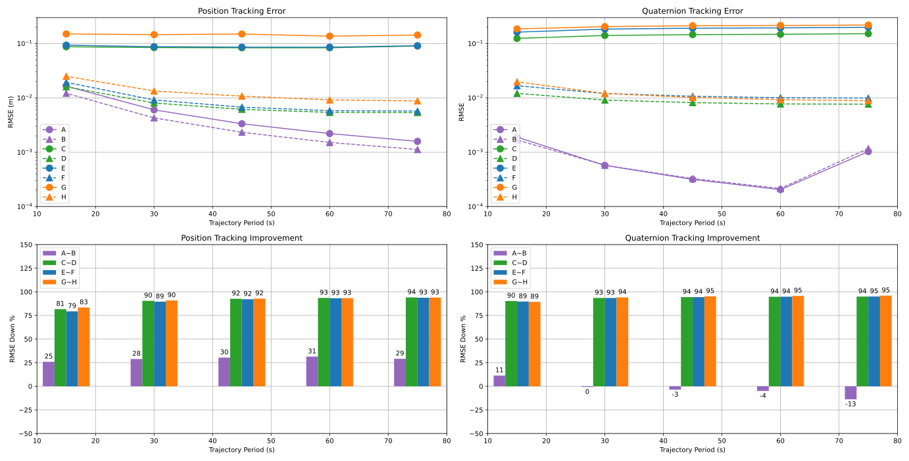
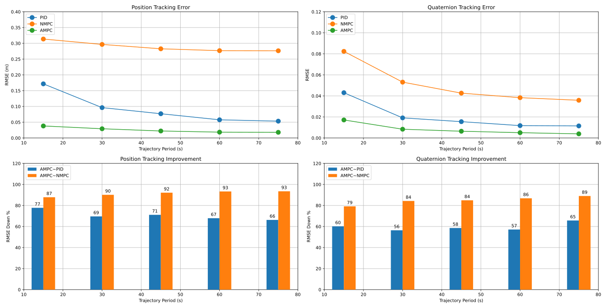
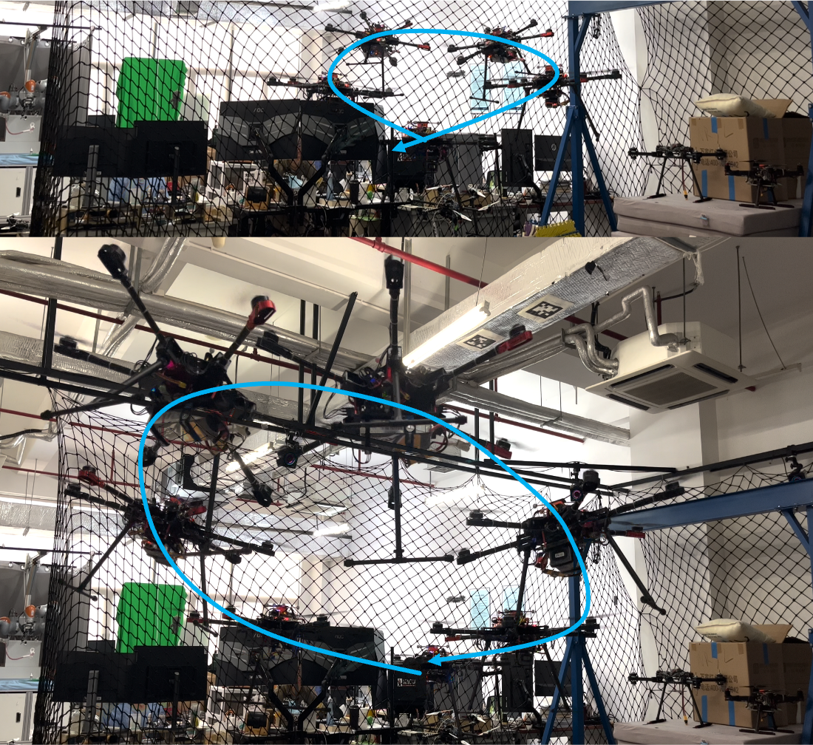

---
## LINKS & DOWNLOADS

* [Presentation of Early Work (English)](https://github.com/ErcBunny/sharedDocs/raw/main/Project%20Experience.pptx)
* [Research Proposal (Chinese)](https://github.com/ErcBunny/sharedDocs/raw/main/omnihex.pdf)
* [Midterm Summary (Chinese)](https://github.com/ErcBunny/sharedDocs/raw/main/中期报告.pdf)
* [Closing Presentation (Chinese)](https://github.com/ErcBunny/sharedDocs/raw/main/wide.pdf)
* [Thesis (Chinese)](https://1drv.ms/b/s!AtUoQjeuHMpihMpIooJgC1C_nQjvbw?e=b5tRRc)
---

## VIDEO DEMO



  

---

## Dev Milestones

1. Upgrade to ROS2: 100%
2. PID and Newton-Euler Dynamics in SITL: 100%
3. Real hardware drivers and maiden flight: 100%
4. Controller architecture and design: 100%
5. Formulate MPC solver using acados: 100%
6. Test MPC solver in Python: 100%
7. L1-MPC python simulation: 100%
8. ROS L1-MPC node: 100%
9. Track trajectories and collect data: 100%
10. Thesis writing: 100%
> Far from perfect, but done for now (May29, 2022)

## Environment Setup

1. `Ubuntu 20.04 LTS` with `ROS2 foxy` and `ROS1 noetic` (since vrpn-client-ros is only available for ROS1).
2. Install ROS2 [via debian](https://docs.ros.org/en/foxy/Installation/Ubuntu-Install-Debians.html) and [additional tools](https://docs.px4.io/master/en/ros/ros2_comm.html#install-ros-2).
3. Install Fast-RTPS-Gen using source code.
   * Install [Gradle v6.3](https://gradle.org/install/) through [sdkman](https://sdkman.io/).
   * Use Gradle to build and install Fast-RTPS-Gen.

```
git clone --recursive https://github.com/eProsima/Fast-DDS-Gen.git -b v1.0.4 ~/Fast-RTPS-Gen \
    && cd ~/Fast-RTPS-Gen \
    && gradle assemble \
    && sudo env "PATH=$PATH" gradle install
```

4. Install dependencies for PX4: `PX4-Autopilot/Tools/setup/ubuntu.sh`.
5. Install officially provided ROS2 plug-ins for Gazebo: `sudo apt install ros-foxy-gazebo-ros-pkgs`.
6. Install [QgroundControl](http://qgroundcontrol.com/) ground station.
7. Install packages for optitrack: `sudo apt install ros-foxy-ros1-bridge ros-noetic-vrpn ros-noetic-vrpn-client-ros`
   * `vrpn-client-ros` publishes the built in message type `geometry-msgs`, it is OK to use debian release of `ros1-bridge`.
   * Building `ros1-bridge` form source enables extra support for custom message and service types but has conflicts with `ros-foxy-controller-manager-msgs`.
8. Install mavros for data visualization: `sudo apt install ros-noetic-mavros* ros-noetic-mavlink`.
9. Dynamixel-sdk `ros-foxy-dynamixel-*`
10. Run `build_acados.sh` to set up the mpc code generation tool.

## Usage

### L1-MPC

1. Models and solvers are formulated in `ros2-workspace/src/adaptive_mpc/tools/omnihex.py`.
2. Run `acados_generate_code.sh` to generate solver code and do numerical simulation.
3. ROS2 Solver node is `ros2-workspace/src/adaptive_mpc/src/l1_mpc_main.cpp`. It has to be recompiled after regenerating the solver code (where control params are defined and stored).

### Simulation with Gazebo

1. Build ROS2 workspace.

```
source /opt/ros/foxy/setup.bash
cd scripts
./build_all_ros_clean.sh
```

2. Build and run PX4 SITL simulation. It is required to source ROS2 setup file.

```
source /opt/ros/foxy/setup.bash
source ./ros2-workspace/install/setup.bash
cd PX4-Autopilot
PX4_NO_FOLLOW_MODE=1 make px4_sitl_ctrlalloc gazebo_omni_hex
```

3. Run `micrortps_agent` over UDP.

```
source /opt/ros/foxy/setup.bash
source ./ros2-workspace/install/setup.bash
micrortps_agent -t UDP
```

4. Use QGC to give commands to the simulation environment. Several useful buttons and modes are listed below.
   - Takeoff and land
   - Virtual joysticks
   - Position mode, altitude mode, ACRO mode
5. Or use the offboard control node to generate a trajectory for omniHex to track.

```
source /opt/ros/foxy/setup.bash
source ./ros2-workspace/install/setup.bash
ros2 run px4_ros_com offboard_control
```

> Above mentioned steps are implemented in `run_simulation.sh`, run this script, take off to `{0, 0, 2.5}` and run `offboard.sh` to track the 8-shape trajectory.

6. If MPC needed, then take off, use `ros2 run trajectory_generator min_ref_publisher 0 0 -2.5 1 0 0 0 0 0 0 0 0 0` to generate a plain state reference, and publish `/RunMpc` topic to actually run the MPC. This topic is designed to be published once for a time when you need to change the flag status.
   
   > TODO: use service instead

### Real World Flight

* Port connections on NUC:
  
  * dynamixel servos on `/dev/ttyUSB0 @ 115200`
  * urtps_bridge on `/dev/ttyUSB1 @ 3000000` -> MCU `TELEM1`
  * QGC/mavlink on `/dev/ttyACM0 @ any baud` (`ACM1` occurs after a reboot) -> MCU `microUSB`

* About RC:
  
  * switch A is the kill switch
  * switch F sets different flight modes (up: altitude, mid: position, down: acro).
1. Setup the motion capture system.
   1. Open motive software and open the most recent project (Z-up configuration).
   2. Go to capture layout (upper-right corner) and delete default rigid bodies.
   3. Aligned markers with the world frame and create a new rigid body from the selected ones, rename this new instance to `uav` (as it is fixed in `ros1-workspace/src/vrpn_client/launch/default.launch`). Data is automatically published to local network.
2. Build PX4 firmware.

```
source /opt/ros/foxy/setup.bash
cd PX4-Autopilot
make cubepilot_cubeorange_ctrlalloc
```

2. Upload firmware to MCU.
   1. Open QGC and navigate to "Vehicle Setup-Firmware".
   2. Plug in MCU through USB (ttyACM) port and QGC will auto detect the MCU. This step requires the MCU only powered by USB.
   3. Select custom firmware and upload `PX4-Autopilot/build/cubepilot_cubeorange_ctrlalloc/cubepilot_cubeorange_ctrlalloc.px4`.
   4. Restart QGC so that airframe files could be loaded by QGC, then you can do further settings and calibration.
3. Build ROS1 workspace.

```
source /opt/ros/noetic/setup.bash
cd ros1-workspace
catkin build
```

4. Build ROS2 workspace.

```
source /opt/ros/foxy/setup.bash
cd scripts
./build_all_ros_clean.sh
```

5. Start packages on NUC: `setup_real_flight.sh`. This script starts the following necessary drivers.
   * ROS1 `vrpn_client`
   * ROS2 `ros1_bridge`
   * ROS2  `micrortps_bridge`, `dyanmixel_driver`, `optitrack`
6. Now you can use packages like rqt or rviz for data monitor and visualization. Make sure to source the corresponding ROS version and workspace.

## Software Version

1. The original version of `PX4` is `stable release v1.12.3`. Modified submodules derive from the commit that is referenced by PX4.
2. The original version of `px4_msg` is commit `0f550f436547fccc6b86d448e095ad914f5de94a` on master branch.
3. `px4_ros_com`: commit `c618d757bd64113ccbee17ad0ae17ab8122337e8` on master branch.

## Coordinate Frame

1. SDF and Solidworks models
   - front-x, left-y, up-z (body)
2. PX4
   - NED (world)
   - front-x, right-y, down-z (body)
3. Gazebo
   - N-Green-y, E-Red-x, U-Blue-z (world) 
4. Arm rotation: see [Control Allocation of a Tilting Rotor Hexacopter](https://doi.org/10.3929/ethz-b-000224598)
5. In SITL, PX4 NED x is aligned with Gazebo y
6. In lab setting, PX4 FRD is algined with optitrack x

## SW Model to SDF

1. There are several useful links
   - [Gazebo official guide](https://gazebosim.org/tutorials?cat=build_robot)
   - [Format standard of `.sdf`](http://sdformat.org/spec)
2. Do NOT use SW2018SP0
3. Minimize the number of links. It is good to treat parts that do not move relatively as a whole. Only separate parts into links if there must be a joint in between. Usually, a link corresponds to an assembly.
4. In the assembly that represents a link, make sure to attach a coordinate frame in the SDF convention to the model. This frame will be used as the reference frame when exporting `.stl` and calculating mass properties.
5. When exporting to `.stl` files, hide fine parts otherwise your file would be too big. Choose the aforementioned reference frame, use meter as the scale, and select "do not transform to positive space".
6. Write the SDF
   - SDF uses kilogram and meter as the default unit.
   - Don't use mesh as collision. Use the geometry shapes instead.
   - Specify a `min_depth` property to the collision that is in contact with the ground.
   - Use numbers in "Moments of inertia, taken at the center of mass and aligned with the output coordinate system". Numbers that are not on the diagonal line of the matrix should be inverted.
7. `sitl_gazebo` plug-ins: "IMU" should be loaded after "mavlink interface".

## ROS1 Packages

### mavros_client

* An overlay package for customizing the launch file. Note that this package should not be named `mavros`, otherwise ROS may not find the right package path.

### vrpn_client

* An overlay package for customizing the launch file.

## ROS2 Packages

### custom_gazebo_plugins

1. This package is a supplement to [officially provided ROS2 plug-ins](https://github.com/ros-simulation/gazebo_ros_pkgs/tree/foxy) and those provided in `PX4-Autopilot/Tool/sitl_gazebo`. The official repository provides example code for writing a plug-in.
2. `gazebo_ros_arm_rotation.cpp` is for controlling the position of six arm joints of omniHex via the `PID` API. Similarly, `gazebo_ros_joint_pid_ctrl.cpp` controls the position of a single joint via `PID`.
3. `gazebo_ros_joint_motor.cpp` is for controlling joint position or velocity via `SetParam` and `SetPosition` API.
4. `gazebo_ros_motor_model.cpp` is a simplified ROS2 adaptation of the original version in `PX4-Autopilot/Tool/sitl_gazebo`.

### px4_msgs

1. This package contains message types needed by `px4_ros_com` and other packages that might use the PX4 types, as well as `rqt` utility.
2. The `msg` folder is updated by the script in `PX4-Autopilot/msg/tools/uorb_to_ros_msgs.py`. It should be synced whenever a message definition in `PX4-Autopilot/msg` is changed.

### px4_ros_com

1. The main purpose of this package is to generate the communication bridge `micrortps_agent` from a template file `src/templates/uorb_rtps_message_ids.yaml`. The template file should be synced with PX4 via script `PX4-Autopilot/msg/tools/uorb_to_ros_rtps_ids.yaml`.

2. There is also an example of off-board control available in `src/examples/offboard`. This example code is modified to generate a full position-pose trajectory as the function of timestamps.
   
   1. circle
   2. 8-shape
   
   > TODO: use input args or launch file to specify trajectory shape

3. It also provides useful scripts for cleaning and building the workspace.
   
   * Previously, `build_ros2_workspace.bash` is set to skip `custom_gazebo_plugins` because the latter depend on `px4_msgs`.
   * It is better to add `<depend>px4_msg</depend>` in `package.xml`. In this way we don't need to specify a order. Make sure to add `find_package(px4_msgs REQUIRED)` and `ament_target_dependencies(foo ...px4_msgs...)` in `CMakeLists.txt`.

### optitrack_driver

1. `visual_odom_publisher` receives pose data from MOCAP, performs frame transformation and publishes data to topic `VehicleVisualOdometry_PubSubTopic`. In this target, the message is published in a timer callback at 50Hz.
2. Timestamps are taken from `VehicleImu_PubSubTopic`. 
3. `callback_relay` is a simple relay. It is similar to `visual_odom_publisher` but instead of publishing data in a timer callback, it publishes data in the callback for receiving pose data.

### dynamixel_driver

1. `read_write_node` is the example node provided by `dynamixel_sdk`.
2. `arm_position_control` is the one used for controlling the arm positions. It communicates with dynamixel servos via UART in the callback function for receiving `ArmRotation_PubSubTopic`.

### trajectory_generator

1. A package for generating trajectories in MPC framework and visualizing `TrajectorySetpoint_PubSubTopic`.
2. Visualization is implemented in `rviz_translator.cpp`

## adaptive_mpc

1. Input topic: `/StateReferenceOcp`, horizon 1s, 20 + 1 nodes

2. Outputs wrench setpoint

3. Switches and flags:
   
   * `/RunMpc`: should be published once every time you wish to change the status of `run_mpc_`. It is switched to false if a solver reset has occurred.

## PX4 Tools and Miscellaneous

1. Set the correct URL in `.gitmodules`.
2. Custom models for Gazebo simulation is put in `PX4-Autopilot/Tools/sitl_gazebo/models` with a corresponding `.world` file in `PX4-Autopilot/Tools/sitl_gazebo/worlds`.
   - The initial condition of the simulation could be set in `PX4-Autopilot/Tools/sitl_run.sh`.
   - Some plug-ins are built externally (in the ROS2 workspace). So `PX4-Autopilot/Tools/setup_gazebo.bash` is modified to export the correct library paths.
3. As we are using the `micrortps_bridge`, we need to build this module in PX4. We can specify this feature by uncommenting the `micrortps_bridge` line in `PX4-Autopilot/boards/px4/sitl/ctrlalloc.cmake`, which is the module configuration file for SITL targets. We can choose what modules to be built and what not to be built. The same rule applies to `.cmake` files for other boards.
4. Add our custom model for gazebo simulation in `PX4-Autopilot/platforms/posix/cmake/sitl_target.cmake`.
5. Add our airframe file (a model-dependent script for loading parameters and modules) for simulation in `PX4-Autopilot/ROMFS/init.d-posix/airframes` and make sure to add this file to the `CMakeLists.txt`.
6. The airframe for real hardware is `init.d/airframes/6004_omni_hex`.
7. A new mixer is in use: `omnihex.main.mix`.
8. `mc_rate_control` isn't started in `rc.mc_apps` if `MIXER = omnihex`

## PX4 Messages

1. Add a message to hold arm positions and limit status: `arm_rotation.msg`. After adding a new message file, don't forget to indicate it in `CmakeList.txt`, otherwise it won't be compiled.
2. Every message should be assigned an ID in `msg/tools/urob_rtps_message_ids.yaml` or targets with `micrortps_bridge` enabled cannot be compiled. Also, we can specify how `micrortps_bridge` treat each message.
3. `vehicle_attitude_setpoint.msg` and `vehicle_local_position_setpoint.msg` are modified to handle roll and pitch movements.

## PX4 Modules

- Generally, a good way to read the code is to look at the header files first. Look at topic subscriptions and publications. Then look at the `run()` function in `.cpp` files.
- Modified modules are `angular_velocity_controller`, `commander`, `control_allocator`, `flight_mode_manager`, `mc_att_control` and `mc_pos_control`.

### angular_velocity_controller

1. Center of mass compensation $x_{com} \cross F_{sp}$ in `AngularVelocityControl.cpp/hpp`, `void AngularVelocityControl::update()`.

2. Read center of mass parameters and call `AngularVelocityControl::update()` with additional arguments in`AngularVelocityController.cpp/hpp`.

3. Newton-Euler equation cross term $\omega_b \cross v_b$ in `void AngularVelocityController::Run()`.

4. Center of mass parameters are defined in `vehicle_model_params.c`.

### commander

1. In `void Commander::update_control_mode()`, ACRO mode is added with the same set of configuration as POSCTL mode.

### control_allocator

1. The allocation matrix (actuator effectiveness) is implemented as a subclass of `ControlAllocationPseudoInverse` and `ModuleParams`. See `ActuatorEffectivenessOmniHex.cpp/hpp/params.c` for more detail. In PX4 convention, torque comes above force in a wrench.
2. Add omniHex to enum classes, switch cases, and includes in `ControlAllocator.cpp/hpp`.
3. Publish control signals to `actuator_controls_0` instead of `actuator_controls_4`, with `actuator_controls_0[3]` reserved for total thrust signal.
4. Always check `CMakeLists.txt`

### flight_mode_manager

1. This module takes care of controller setpoints in different flight modes.

2. Switch to `FlightTaskIndex::ManualAcceleration` when in `vehicle_status_s::NAVIGATION_STATE_ACRO`. This feature is implemented in `FlightModeManager.cpp`.
   
   > TODO: exclusive flight task for ACRO mode (not only pitch but full pose)

3. `FlightTask.cpp/hpp`: add missing variables and functions that are not implemented for roll and pitch commands.

4. `FlightTaskManualAltitude.hpp`: add scaling factors from stick to roll and pitch rate.

5. `FlightTaskManualAcceleration.cpp/hpp`: generate different setpoints in different navigation states.

6. Set roll pitch angle and angular speed setpoint in `FlightTaskFoo::activate()` function of tasks such as `Auto`, `Failsafe` and `ManualAltitudeSmoothVel`. This is necessary because otherwise the vehicle loses roll and pitch control when auto buttons in QGC is pressed.

### mc_att_control

1. `AttitudeControl.cpp`: `matrix::Vector3f AttitudeControl::update()` is modified to consider turning rate feed-forward.
2. `AttitudeControl.hpp`: add roll and pitch in `void setAttitudeSetpoint()`, also variables.
3. `mc_att_control_main.cpp` and `mc_att_control.hpp`: call modified function with the right arguments.

### mc_pos_control

1. `PositionControl.cpp/hpp`: add variables to take care of roll and pitch rotation. In `void PositionControl::getAttitudeSetpoint()` attitude setpoints are passed down and thrust setpoint is converted into body frame.
2. `mc_pos_control_params.c`: define parameters for manual roll and pitch rate control, which are used in `FlightTaskManualAltitude.hpp`.
3. `MulticopterPositionControl.cpp/hpp`: call modified functions and pass correct arguments.

### EKF2

1. In `PublishAttitude`, an extra step of converting and publishing RPY is added.

## mixer & px4io

1. `AllocatedActuatorMixer.cpp` now listens to `actuator_controls_0` instead of `actuator_controls_4`.

2. ESC calibration parts in `px4io.cpp` and `mixer_module.cpp` are modified for `control[0]` to `control[6]`, except `control[3]`.
   
   > TODO: test calibration function, <u>***make sure props are removed***</u>

## Motor-Propeller Model

### SITL

1. In `gazebo_motor_model` and `omni_hex.sdf`
   * `motorConstant = thrustCoef = 8.5e-06`
   * `torqueCoef = thrustCoef * momentConstant = 8.5e-06 * 0.06`
2. In `px4`
   * The thrust coefficient if defined as `Thrust = CT * u^2`, where u (with value between CA_ACT0_MIN and CA_ACT0_MAX) is the output signal sent to the motor controller. `CT = 19.125`
   * The moment coefficient is defined as Torque = KM * Thrust (is consistent with momentConstant). `KM = 0.06`
3. From u (PX4) to $\omega$(real rotor angular velocity)
   * `PWM = 1000 * (1 + u)` (observation from print-debugging), where `u = actuator_setpoint[0, 1]`
   * `omega = (u + offset) * scaling + idle` @(line ~1121 mavlink interface plugin), in sdf `offset = 0; scaling = 1500; idle = 100`
4. Conversion between `CT`(PX4) and `motor constant` (thrust coef, paper, plugin), we assume that the idle value is negligable
   * `CT = scaling^2 * motorConstant`

### Real World Data

> TODO: mapping between PWM and angular velocity, determine thrust and torque coefficient

1. `x = actuator_setpoint[0, 1]` to `y = actuator_controls_0[-1, 1]`: $y=2x-1$
2. `x = actuator_controls_0[-1, 1]` to `y = PWM[min, max]`: $y=\frac{x(y_{max}-y_{min})}{2}+\frac{y_{max}+y_{min}}{2}$
3. `x = PWM[min, max]` & `y = relative_thrust[0, 1]`: $ay^2+(1-a)y-x=0$, where $a\in[0.25,0.35]$

## Matlab Files

1. In `matlab-workspace`.
2. `trajectory.m`: visualization of 8-shape trajectory.
