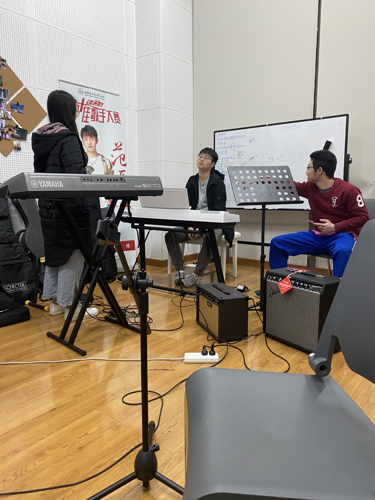

---
## January
* 上自控实践的实验课部分
* [完成了pyTimelapse](/p/pytimelapse)
* 在T3实验室弄工训无人机
* [上一年的年度总结](/p/2020年度总结)

 

 

---
## February
* 收到了人生第一台Macbook，结果脚垫竟然不平
* 一家人去了趟宝墨园，踏春
* 放假跟着去南沙网球基地试了红土地，放了烟花
* 回学校赶上发烧还小题大做上报去深大医院做核酸
* 开始了自控B的学习，手机里拍照图，再次怀念ZY老师的自控A的讲稿

 

  

---
## March
* 开始了电工实习，机器人导论，以及好多痛苦的一堆课
* 发现麦当劳的早餐薯饼夹入吃法，好评
* XMQ加入了我和CLX的Workout计划，但也就坚持了一两周
* 考了TOEFL，考完被晾在考场自生自灭，途中看到了撸猫猫大队
* 开始了omniHex项目，现在回想起来真的走了好多弯路

 

 

---
## April
* 四月的一开头就是KTV黑照暴击(雷宝哈哈哈)
* 工训赛测试稳了，结果惨不忍睹
* 学校羽毛球比赛开始

  

---
## May
* 电工实习终于结束了
* 自控实践实验课结束
* 从此也是ROG公民了
* 学校羽毛球比赛结束，亚军，好耶
* 这个月景色很好

  

 

---
## June
* 四食堂开了，当时的小炒yyds，后面就真的再没迟到过第一次去的味道了……
* 肝完了机器人导论课设
* 在G305摸了一块地方作为办公位置，赶上了科创学院的剧组拍摄宣传片
* 是不是感觉这个月平平无奇，嗯，因为在肝omniHex

 

 

---
## July
* 给笔记本清灰换内存，32G拉满
* 从WHL嫖来了米哈游的夏日零食箱，只有箱子
* omniHex实现了位置和姿态的解耦控制
* 回GZ和高中宿舍小伙伴小聚
* 买了个蒂蒂抱枕

   

---
## August
* omniHex实体机器人完成组装，过程真的很累，迂回前进
* 开始投学校了，面了港大两个弄机器人的实验室，MARS不要我，ARCLAB让我做RA；对比同期RYF学长已经可以直接拿口头offer了

 

---
## September
* 去了一趟CUHKSZ，好玩，见到了好多老同学
* 社团招新，终于有点SS那味道了，加入了合唱团
* 拍了毕业证上的照片，可惜当时不会打理头发，所以效果不行，只能说还凑合
* pyTimelapse手机电池鼓包了呜呜呜，移到了室内
* 吹爆CSY老师的Media & Culture课，真的好棒，而且给了我
* 以摸鱼的速度开始准备GRE

  

---
## October
* 从集市上得知一食堂的肠粉，广东人泪目
* 考了一次GRE沉了，痛定思痛开始准备二战
* 到隔壁清华参加他们的某个晚会，感叹不愧是清华（当时这么酸，但是后来发现工大后来的其实也不差）

 

---
## November
* 通过了一个EPROP-HKUST的联合培养项目，去那边看了下，受到了热情招待，但是最后感觉条件有点限制就算了
* 金星伴月（大概？
* 重做了精细版本的omniHex仿真模型
* 合唱团第一首曲目大概排出来了Ave Maria
* [完成了DIP课程设计](/p/dash-to-cones)

 

 

---
## December
* 去艺术团摸鱼的时间增多了，练声，玩阿卡贝拉，混入彩排
* 各种课结课
* 投递了各种申请
* 控制杯羽毛球二轮游
* GRE上岸后去看运动会
* 个人网站上线
* 寿喜锅自助，然后从深圳湾沿河边骑车回来
* 游园会，好多好有意思的，就是高级版社团节，还上去舞台唱了歌儿但是车祸现场
* 终于参加了一次元旦晚会，但是是上去混的哈哈哈哈，艺术团的小伙伴们好好玩

  

 

 