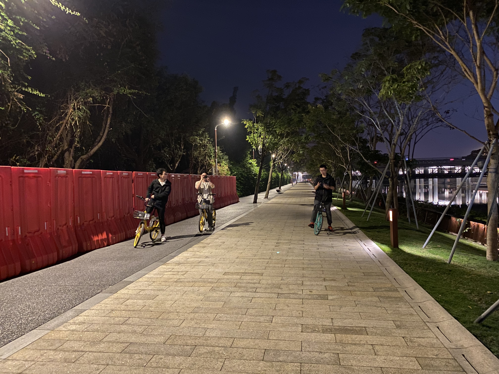

---
## 前言

看着之前的年度总结，不经感叹我以前真的好认真啊，现在就貌似已经开摆了，只能靠翻相册来回忆这一年发生了什么事情这个样子（哭）。

不过也很有趣啦，回顾照片什么的，能找回当初拍摄每一张照片的心动的感觉。

总之就是篇post就是这一年的点点滴滴啦～看起貌似真的啥也没干哦……

不对，应该说是忙得很充实，见证了许多美景，遇见了许多有意思的伙伴。

新的一年希望还是能够拿到Offer啦，然后……然后无限进步！😆PEACE～（若有图片涉及肖像权问题，侵删～）

---
## January
* 上自控实践的实验课部分，手机里存了好多多多多试验设备照片啊啊啊啊
* [完成了pyTimelapse](/p/pytimelapse)，我愿称之为好活
* 在T3实验室弄工训无人机，当时的心态是抱着拿国奖加分去的，后面的结局证明年轻人做事情还是不要太功利
* [上一年的年度总结](/p/2020年度总结)，妈耶写的好详细，给跪了

 

 

---
## February
* 收到了人生第一台Macbook，结果脚垫竟然不平，后面去天环广场给换了，M1确实续航强无敌，果子的入门级移动设备果然不会让人失望
* 一家人去了趟宝墨园，踏春，好看～
* 放假跟着去南沙网球基地试了红土地，放了烟花，好多好视频放不上来，也懒得传B站了（是啊我怎么这么懒啊
* 回学校赶上发烧还小题大做上报去深大医院做核酸，mdzz，就是脑袋一热想要给疫情防控做贡献的感觉？
* 开始了自控B的学习，手机里拍照图一堆一堆的（现在看也是完全看不懂了哈哈哈呜呜呜😭），再次怀念ZY老师的自控A的讲稿

 

  

---
## March
* 开始了电工实习，机器人导论，以及一堆课（evidence by screenshots and slide photos）
* 发现麦当劳的早餐薯饼夹入吃法，好评
* XMQ加入了我和CLX的Workout计划，但也就坚持了一两周
* 考了TOEFL，考完被晾在考场自生自灭，途中看到了撸猫猫大队
* 开始了omniHex项目，现在回想起来真的走了好多弯路，不说了，都是泪

 

 

---
## April
* 四月的一开头就是KTV黑照暴击(雷宝哈哈哈)
* 工训赛校内测试时候以为稳了，结果惨不忍睹，失败点在于图像识别算法对光照条件变化的鲁棒性太差
* 院羽毛球赛开打～轻羽飞扬（bushi

  

---
## May
* 电工实习终于结束了，用MSP430撸了一个智能（zz）电扇，以后应该再也不会去碰这玩意儿了
* 从此也是ROG公民了，当时R9000p没货，反手就入了ROG，逼上梁山了属于是
* 学校羽毛球比赛结束，亚军，好耶😄
* 这个月景色很好，真的绝绝子！！！

  

 

---
## June
* 四食堂开了，当时的小炒yyds，后面就真的再没吃到过第一次去的味道了，怎么说，四食堂有种有恃无恐的感觉……
* 肝完了机器人导论课设，[HLJenga Rules!](p/hljenga-hexalink-jenga-manipulator)
* 在G305摸了一块地方作为办公位置，赶上了科创学院的剧组拍摄宣传片，呵呵呵呵呵还以为能见到Prof. Shaojie Shen呢，看来是想多了
* 是不是感觉这个月平平无奇，嗯，因为在肝omniHex，走弯路中

 

 

---
## July
* 给笔记本清灰换内存，32G内存拉满
* 从WHL嫖来了米哈游的夏日零食箱，谢谢导师（游戏内master）～虽然只有箱子
* omniHex实现了位置和姿态的解耦控制
* 回GZ和高中宿舍小伙伴小聚，毕竟放假嘛呵呵呵
* 买了个蒂蒂抱枕，为斯卡蒂献上心脏！！！

   

---
## August
* omniHex实体机器人完成组装，过程真的很累，迂回前进，以至于不想过多描述
* 开始投学校了，面了港大两个弄机器人的实验室，MARS不要我，ARCLAB让我做RA；对比同期RYF学长已经可以直接拿口头offer了，看来我是个FW

 

---
## September
* 去了一趟CUHKSZ，好玩，见到了好多老同学，同学们都好优秀啊啊啊
* 社团招新，终于有点SS那味道了，随后加入了合唱团
* 拍了毕业证上的照片，可惜当时不会打理头发，所以效果不行，只能说还凑合
* pyTimelapse手机电池鼓包了呜呜呜，移到了室内
* 吹爆CSY老师的Media & Culture课，真的好棒，而且给了我真正表达自己、练习口语的机会。感觉其他同学都有点小害羞不知道为啥，可能是准备run了，在这个学校已经没有在意的人了叭
* 以摸鱼的速度开始准备GRE，后面果然寄了

  

---
## October
* 从集市上得知一食堂的肠粉，广东人泪目
* 考了一次GRE沉了，痛定思痛开始准备二战
* 到隔壁清华参加他们的某个晚会，感叹不愧是清华，当时这么酸，但是后来发现工大后来的其实也不差嘛哈哈哈（就是说人总是一边受着母校的照护，享受着光环的加护，又一边骂她哪里哪里不好，当然内心里却是真心希望她能变的更好这样子）

 

---
## November
* 通过了一个EPROP-HKUST的联合培养项目，去那边看了下，受到了热情招待，但是最后感觉条件有点限制就算了（如果真的去了我现在基本就躺平了，导师随便挑，港科大PHD手到擒来。不过接下来接近一个decade的人生轨迹也大致确定了，一这么想就觉得有点可怕）
* 看到了金星伴月（大概？），当时好多人在路上拍，我和LX刚好跑完步，感叹真的很漂亮
* 重做了精细版本的omniHex仿真模型，都是泪啊
* 合唱团第一首曲目大概排出来了Ave Maria～LHX sensei yyds
* [完成了DIP课程设计](/p/dash-to-cones)

 

 

---
## December
* 去艺术团摸鱼的时间增多了，练声，玩阿卡贝拉，混入彩排
* 各种课结课了，我免费（free）了哇哈哈哈哈
* 投递了各种申请，海了9所，遍布北美，欧陆，南亚，远东……希望有人要我，求求了……
* 控制杯羽毛球二轮游（就当是参与实验室团建拍照了
* GRE上岸后去看运动会，当时是一个春风得意啊，就差一日看尽长安花了
* 个人网站上线，感谢GitHub Page服务，感谢Jimmy的Theme
* 寿喜锅自助，然后从深圳湾沿河边骑车回来，感谢同行HXD的陪伴，是今年做的为数不多的让人感觉“我还年轻”的事情
* 游园会，好多好有意思的，就是高级版社团节，还上去舞台唱了歌儿，但是车祸现场……嗯看来确实得认真学几首歌能一下子拿的出手的歌啊（之后集市上有好多表白XGG的，为什么没有我💔，我是FW）
* 终于参加了一次元旦晚会，但是是上去混的哈哈哈哈，艺术团的小伙伴们好好玩，谢谢你们，让我能够完成“登上元旦晚会舞台”的[TODO list](/p/愿望清单)

  

 

 